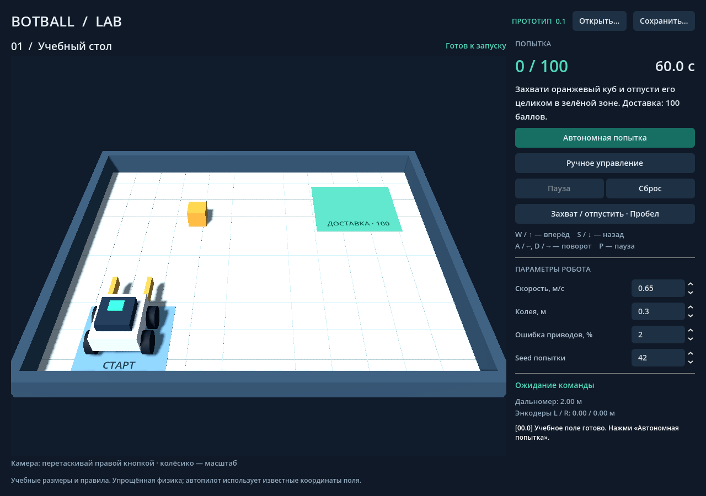

# Botball Lab

Настольный 3D-прототип для macOS на **Godot 4.5.2 / GDScript**. Один учебный стол, один робот и доставка одного куба. Интерфейс на русском. Работает без сервера и интернета.



## Что работает

- Поле 3 × 2,4 м с бортами, сеткой, стартовой зоной и зоной доставки.
- Физическое тело робота: масса деталей, центр тяжести, инерция, силы колёс, сцепление, проскальзывание, падение и опрокидывание. Показ массы, баланса слева/справа, наклона и оранжевый маркер центра тяжести.
- Ручная и автономная попытки, таймер 60 секунд, пауза и сброс.
- 100 баллов, когда отпущенный куб целиком находится в зоне и стабилизировался на столе не менее 0,4 секунды. После доставки попытка заканчивается.
- Лучевой датчик расстояния (до 2 м), расчётные энкодеры приводов и журнал событий.
- Настройка максимальной скорости, эффективной колеи, ошибки приводов и seed.
- 3D-конструктор из 156 устанавливаемых позиций каталога Botball 2026: поиск, фильтр, просмотр детали, размещение, поворот и контроль количества.
- Сборка по точкам крепления: пины, оси, LEGO-шипы, винты 8-32 и гайки 8-32/M3; совмещение, проверка совместимости, занятых отверстий и профиля оси. Соединённые узлы перемещаются вместе и сохраняются в проекте.
- 101 модель LEGO из LDraw и 16 моделей из официального KIPR Simulator; 39 остальных моделей приближённые и отмечены в интерфейсе.
- Сохранение/открытие настроек и сборки проекта в JSON с проверкой формата. Открытие проекта начинает новую попытку; промежуточное состояние физики не сохраняется.
- Установщик `.dmg` и архив `.app` для Apple Silicon и Intel. GitHub Actions проверяет симуляцию, собирает DMG на macOS и публикует версионный релиз.
- Автоматическая проверка обновлений при запуске и кнопка «Обновления» для скачивания нового установщика.

## Запуск на Mac

1. [Скачай Botball-Lab-macOS.dmg](https://github.com/so-s1m4/botball_app/releases/latest/download/Botball-Lab-macOS.dmg) из [последнего релиза](https://github.com/so-s1m4/botball_app/releases/latest).
2. Открой `.dmg` и перенеси `Botball Lab.app` в «Программы».
3. Открой приложение и нажми «Автономная попытка».

Сборка подписана локальной ad-hoc подписью, без сертификата Apple Developer ID и нотариализации. При блокировке macOS открой «Системные настройки → Конфиденциальность и безопасность → Всё равно открыть» после первой попытки запуска. Подробности: [документация Godot о запуске приложений macOS](https://docs.godotengine.org/en/4.5/tutorials/export/running_on_macos.html). Не отключай Gatekeeper целиком.

ZIP проверяется на Linux, установщик DMG собирается и проверяется через `hdiutil` на macOS в GitHub Actions. Ручной запуск интерфейса на физическом Mac пока не проверен.

Приложение проверяет публичный GitHub Releases API при запуске. Без интернета симулятор продолжает работать. При доступной новой версии появляется кнопка скачивания `.dmg`; установка выполняется вручную: сохрани проект, закрой приложение и замени его в «Программах». Кнопка «Обновления» повторяет проверку. Файлы проектов и пользовательские настройки не удаляются. Автоматической замены работающего приложения пока нет.

## Управление

| Действие | Управление |
| --- | --- |
| Движение | W/S или ↑/↓ |
| Поворот | A/D или ←/→ |
| Захват / отпускание | Пробел или кнопка |
| Пауза / продолжение | P или кнопка |
| Поворот камеры | Правая кнопка мыши + движение |
| Масштаб камеры | Колёсико мыши |

Перед ручным управлением нажми «Ручное управление». Новый запуск сбрасывает стол. Параметры блокируются на время попытки. Ошибка привода задаёт постоянное отклонение скорости каждого мотора на попытку; тот же seed воспроизводит отклонения.

## Конструктор

Открой «3D-конструктор» в верхней панели. Добавь основание из каталога, затем следующую деталь. В режиме «Сборка по креплениям» выбери крепление выбранной детали в списке или нажатием на бирюзовую точку. Оранжевые точки показывают свободные совместимые крепления других деталей. Выбери целевую точку мышью или в списках «Соединить с», задай угол и нажми «Соединить». Деталь автоматически совмещается с креплением и поворачивается вдоль оси отверстия.

Детали можно жёстко соединять напрямую через любые свободные размеченные отверстия, в том числе металлическую платформу и LEGO-балку. В простом режиме список «Крепление детали» позволяет выбрать отверстие на новой детали, зелёные точки — место на сборке, «Повернуть» — ориентацию, а предварительный просмотр показывает результат. Доступны обе стороны отверстий; поверни камеру или переверни сборку. Мотор и серво можно крепить в любое размеченное отверстие; мотор получает крепёж автоматически. Прямое соединение отверстий — упрощённое жёсткое крепление без отдельной модели винта или пина. Занятое отверстие блокируется с обеих сторон. Сборка сохраняется и участвует в расчёте массы и центра тяжести.

Для отдельного крепежа балка соединяется с балкой через пин, крестовое отверстие — с осью, LEGO-гнездо — с шипом, металлический лист — с винтом 8-32, гайка — с соответствующей резьбой 8-32 или M3. Несовместимые крепления и занятые отверстия заблокированы, включая вход с обратной стороны. Для крестовых осей профиль совмещается автоматически, поворот задаётся с шагом 90°. Другие соединения допускают поворот с шагом 15°. Крепления металлических деталей приблизительные и отмечены «≈».

Изменение X/Y/Z в миллиметрах или углов выбранной детали перемещает весь соединённый узел. «Отсоединить» освобождает все крепления выбранной детали. Удаление крепежа разъединяет связанные через него детали. Выключение режима креплений позволяет размещать детали ЛКМ по сетке 8 мм на текущей высоте; высоту и координаты можно вводить с шагом 0,1 мм. ПКМ вращает камеру, колесо меняет масштаб. Для деталей без разметки отверстий доступно приближённое «Крепление корпуса» к любому отверстию; оно не обозначает настоящее отверстие в модели. Также доступно свободное размещение.

Остаток в каталоге уменьшается при добавлении и восстанавливается при удалении. Отвёртка и ключ исключены. «Сохранить…» сохраняет детали, преобразования и взаимные соединения вместе с настройками; проекты без соединений поддерживаются. При открытии проверяются граф соединений, совместимость, занятость и геометрическое совмещение точек. Открытие конструктора сбрасывает попытку. Сборка отображается на роботе на поле и сохраняется при сбросе/перезапуске попытки.

Исходная разметка содержит 112 из 156 деталей и 1681 точку крепления; дополнительные крепления приводов и корпуса дополняют её для остальных моделей. Отверстия и встроенные пины LEGO извлечены из примитивов LDraw в координатах импортированных моделей; гнёзда прямоугольных пластин — из сетки LEGO, простые оси — из геометрии стержня. Крепления приблизительных листовых деталей соответствуют их отображаемой геометрии; размеры резьбы и точки крепежа приблизительные. Скрипт `scripts/build_connections.py` воспроизводит разметку без сети.

На поле масса и формы столкновений берутся из сборки; установленные закреплённые моторы и колёса создают тягу. Серво двигает связанный рычаг и меняет центр тяжести. Пустая сборка возвращает учебного робота. Параллельные шестерни и рейки передают движение через расчётные соединения. Нет вворачивания резьбы, деформаций и электрических кабелей.

Использованы библиотеки [LDraw.org](https://www.ldraw.org/) (CC BY 2.0/4.0 согласно заголовкам исходников) и [KIPR Simulator](https://github.com/kipr/Simulator) (GPL-3.0). Исходники, лицензии и преобразования: [assets/parts/README.md](assets/parts/README.md).

## Разработка и проверка

Открой `project.godot` в Godot 4.5.2 и нажми F5. Для сборки установи официальные экспортные шаблоны той же версии через Editor → Manage Export Templates.

```bash
godot --headless --editor --import --quit
godot --headless --path . --script tests/smoke.gd --fixed-fps 120
godot --headless --path . --script tests/parts.gd
godot --headless --path . --script tests/connections.gd
godot --headless --path . --script tests/physics.gd --fixed-fps 120
godot --headless --path . --script tests/updates.gd
GODOT_BIN=godot scripts/build_macos.sh
```

Архив появляется в `build/Botball-Lab-macOS.zip`. На macOS `GODOT_BIN=godot scripts/build_dmg.sh` также создаёт `build/Botball-Lab-macOS.dmg` и `SHA256SUMS.txt`. После успешного push в `main` GitHub Actions публикует релиз для версии из `project.godot`; для следующего обновления увеличь `config/version` и обе версии приложения в `export_presets.cfg`. Существующие релизы не перезаписываются. Проверки: доставка, граничные настройки скорости/колеи/шума, повтор seed, ручное движение, столкновение с бортом, пауза, сброс, захват, границы зоны, отсутствие очков за удерживаемый куб, тайм-аут, сохранение и повреждённые файлы проекта.

## Ограничения прототипа

Это учебное задание, **не правила официального сезона**. Робот и куб — RigidBody3D. Godot рассчитывает гравитацию, контакты и опрокидывание. Масса и диагональные моменты инерции складываются из деталей; перемещение рычага серво обновляет центр тяжести. Силы ведущих колёс приложены у контакта с картой, ограничены моментом двигателя и сцеплением. Скорость нарастает постепенно; энкодер измеряет расчётное вращение колеса, поэтому при пробуксовке путь отличается от показаний.

Массы деталей оценочные, параметры двигателя и сцепления учебные. Колёса имеют цилиндрические коллайдеры, остальные детали — коробки; отверстия не участвуют в столкновениях. Сцепление рассчитывается по лучам под ведущими колёсами и приближённой развесовке; нет подвески и отдельной динамики каждого колёсного сустава. В готовой двухколёсной сборке конец платформы служит скользящей опорой. Во время попытки скорость и момент серво ограничены. Захват использует приближённые упругие контакты и ограничение силы трения; куб остаётся отдельным динамическим телом и передаёт нагрузку роботу через силы.

Есть импорт GLB, выбор карт и редактор псевдо-Python. Демонстрационный автопилот использует известные координаты; пользовательский код управляет приводами и читает виртуальные датчики. Автоматический поиск лучших конструкций не реализован.

### Изображения деталей и материалы

Каталог конструктора показывает изображения всех 156 доступных моделей, названия и остаток в наборе. Поиск и фильтр категории работают с карточками; собранные детали тоже отображаются с миниатюрами. Изображения поставляются внутри приложения и доступны без интернета.

Для пластика, металла и резины добавлены бесшовные процедурные normal map текстуры и разные параметры блеска. Исходные цвета многоматериальных моделей KIPR сохранены; покрытие одинаково в конструкторе и на поле. Это визуальная фактура материалов, а не фотографические сканы деталей. Геометрия и крепления не изменены.

Перегенерировать миниатюры после изменения моделей или материалов: `godot --path . --script scripts/render_thumbnails.gd` (нужен графический рендерер). Затем импортировать новые PNG в редакторе.

### Совместная сборка на разных ОС

Нажми «Совместно» → «Создать комнату» и отправь ссылку участникам. В браузере ссылка автоматически подключает к общей сборке; в приложении macOS вставь её в «Совместно» → «Подключиться». Веб-версия работает на Windows, macOS и Linux с поддержкой WebGL 2. Для комнаты нужен интернет; локальный конструктор и экспорт файлов работают отдельно.

Детали и соединения синхронизируются примерно раз в секунду, сборка сохраняется на сервере. Изменения разных деталей объединяются. При одновременном изменении одной детали конфликтующий клиент отключается от комнаты и сохраняет свою версию для экспорта; чужая работа не перезаписывается. При потере связи редактор также сохраняет локальную модель. Для повторного подключения используй ту же ссылку. Все владельцы ссылки могут редактировать робота.

Камера, выбранная деталь, карта, программа и физическая симуляция у каждого свои. Принятое удалённое изменение сбрасывает локальную попытку и историю отмены, чтобы отмена не вернула чужую работу назад. Выход из комнаты оставляет последнюю сборку локально.

Сервер: `node server/collaboration.mjs` (Node.js 22+, порт `BOTBALL_PORT`, по умолчанию 8094). Он отдаёт только `build/web` и API комнат; файлы комнат в `server/rooms` не публикуются и исключены из Git. Для preview: `deploy-preview --port 8094 botball-lab`. Ссылка доступна, пока runner работает; комнаты сохраняются на его диске между перезапусками сервера.

### Импорт и экспорт роботов

В меню «Файл» основного окна или «Модель» конструктора выбери «Экспорт робота…». Файл `.botball-robot.json` содержит детали, координаты, повороты и соединения; его можно передать другому пользователю и открыть через «Импорт робота…». В браузере экспорт скачивает файл, а импорт открывает выбор файла на компьютере. Импорт заменяет текущую сборку и сбрасывает попытку, сохраняя карту, программу и настройки. Его можно отменить в конструкторе через «Отменить» или Ctrl/⌘+Z. Повреждённые файлы отклоняются до изменения сборки.

Полные проекты сохраняются отдельно через меню «Файл». Примеры и создание пустой сборки находятся в меню «Модель»; параметры и показания датчиков открываются переключателем «Настройки и телеметрия».

### Простой режим сборки

Конструктор по умолчанию показывает группы «Платформа», «Моторы», «Колёса», «Крепёж», «Все». Выбери платформу и нажми «Взять платформу». Выбери мотор: на платформе появятся подходящие зелёные места; наведение показывает полупрозрачный результат, нажатие автоматически совмещает крепления. «Перевернуть» переворачивает весь узел. «Прикрутить мотор» добавляет два винта 8-32 из набора; колесо Solarbotics можно надеть на вал после крепления мотора. Второй мотор ставится таким же образом. Отмена возвращает детали в набор; Esc откладывает выбранную деталь. Выбор установленной детали доступен и нажатием на неё в 3D.

Координаты и ручной выбор отдельных креплений находятся в «Дополнительно». LEGO использует прежние совместимые крепления. Места для моторов и их винтов — приближённая учебная разметка (`assets/parts/easy_mounts.json`); расчёта прочности, прижима кронштейнов и передачи вращения нет. Связи сохраняются прежним форматом; дополнительные точки добавляются после существующих индексов.

Проверка полного сценария: `godot --headless --path . --script tests/easy.gd`.

### Карты и импорт GLB

Над полем можно выбрать учебный стол, полосу препятствий или «Своя карта (.glb)…». Кнопка «Загрузить GLB…» открывает выбор файла. Карта загружается во время работы приложения через [GLTFDocument](https://docs.godotengine.org/en/stable/classes/class_gltfdocument.html), сохраняет материалы и текстуры и получает статические столкновения по геометрии. Собственные камеры, освещение и анимации карты отключаются. По умолчанию размер вписывается в стол 3 × 2,4 м; справа можно изменить масштаб или выключить вписывание, используя исходные метры GLB. Робот и куб размещаются на поверхности карты.

Копия карты с встроенными ресурсами хранится в `user://maps`, выбор и масштаб — в проекте. Перемещение исходного GLB не ломает сохранение; при переносе проекта на другой компьютер карту нужно загрузить заново. Старые проекты открывают учебный стол. Ошибка импорта оставляет текущую карту. Учебная цель и автопилот остаются прежними; официальные правила и навигация вокруг произвольных препятствий из GLB не извлекаются.

Проверка импорта, масштаба, сохранения и столкновений: `godot --headless --path . --script tests/maps.gd`.

### Проверка сборки на карте и программа робота

«Тестировать на карте» в конструкторе запускает ручную проверку именно текущей сборки. Движение требует двух закреплённых моторов с колёсами Solarbotics; колея определяется расположением колёс, геометрия столкновений — габаритами отдельных деталей. Платформа без приводов не ездит. Колёса анимируются. Учебный захват не подставляется вместо деталей собственной сборки.

Сервомотор крепится к отдельному подсвеченному месту на платформе. В группе «Моторы» доступны круглый и длинный рычаги серво: надень рычаг на подсвеченный выход. Изменение угла поворачивает рычаг и присоединённые к нему детали; корпус остаётся на месте. Положение исполнения отделено от сохранённого положения сборки. Связи, блокирующие выход серво, запрещают вращение.

Кнопка «Код робота» открывает редактор небольшого Python-подобного языка. Номера моторов и серво соответствуют порядку деталей в сборке и показаны над редактором. Все установленные моторы и серво имеют отдельные номера; движение передаётся колёсам подключённых моторов. Для учебного робота без сборки доступны два виртуальных мотора. Пример:

```python
motor(1, 60)
motor(2, 60)
servo(1, 120)  # нужна установленная серва
wait(1)
stop()
```

Команды: `motor(номер, мощность)` (−100…100), `servo(номер, угол)` (0…180°), `drive(лево, право)` для всех ведущих колёс, `wait(секунды)`, `stop()`, `print(значение)`. Выражения поддерживают переменные, арифметику, сравнения, `abs`, `min`, `max`, `sin`, `cos`, `clamp`; блоки — `for i in range(...)`, `while`, `if / else` с отступом 4 пробела. `distance()` возвращает показание виртуального дальномера в метрах, `encoder(номер)` — пройденное приводом расстояние в метрах, `time()` — время программы в секундах. Это не полноценный Python: импорты, сторонние библиотеки и пользовательские функции не поддерживаются.

Программа выполняется на выбранной карте, при паузе время ожидания останавливается, при продолжении мощность восстанавливается, остановка и завершение программы отключают моторы. Циклы регулярно уступают выполнение интерфейсу; ошибки показывают строку. Текст программы сохраняется вместе с проектом. Программный запуск не ограничен 60-секундной учебной попыткой. Примеры в редакторе показывают движение, серво, квадрат и дальномер.

Моторы создают ограниченные моментом силы у контакта колёс; масса, инерция, сцепление и перевес учитываются. Электрические подключения не рассчитываются. Форма столкновений деталей приближена коробками и цилиндрами колёс. В попытке серво движется постепенно; нагрузка от веса на рычаге снижает скорость вплоть до остановки. До запуска угол можно выставить сразу для предпросмотра. Рычаг серво сам по себе не становится готовым захватом куба; код позволяет проверить его движение. Карта импортируется как статическая геометрия.

Проверка привода собственной сборки, рычага серво, интерпретатора, паузы и сохранения: `godot --headless --path . --script tests/programs.gd --fixed-fps 120`.


### Готовый робот и обновлённые модели (0.6.0)

При запуске на карте уже установлен робот из каталога: платформа, два мотора, четыре винта и два колеса. Для проверки нажми «Ручное управление» или запусти первый пример в «Код робота». Конструктор открывает эту же сборку; «Готовый робот» восстанавливает её, «Собрать с нуля» начинает пустую сборку. Оба действия можно отменить.

В простом режиме выбор мотора показывает крупные кнопки «Слева · с винтами» и «Справа · с винтами». Установка автоматически добавляет два винта и переключает каталог на колёса. Нехватка крепежа отменяет весь шаг. Для мотора из старого проекта кнопка «Прикрутить мотор» находит незакреплённый мотор даже при выборе другой детали. Свободно лежащий мотор нужно сначала установить на платформу.

Исправлены боковые стенки шасси и каналов, направление выхода мотора и положение креплений. Все 156 моделей получили нормали с сохранением острых граней; 39 приближённых моделей — более подробные отверстия, фаски и крепёж с резьбой и углублением в головке. Материалы различают шину и ступицу, корпус и металл, провода разных цветов. Освещение конструктора и карточек использует отражения студийного окружения. Геометрия LDraw и KIPR сохранена; 39 оценочных моделей остаются приближёнными, размеры не получены из заводского CAD.

Проекты 0.5.0 с обычной сборкой платформы, моторов и колёс автоматически совмещаются с новыми точками при открытии. Старые файлы не перезаписываются. Если замкнутые связи сложной сборки нельзя совместить с исправленной геометрией, приложение сообщает об этом. В новых проектах сохраняется версия геометрии.

Обработка геометрии: `python3 scripts/refine_part_models.py`, затем `python3 scripts/build_connections.py`, импорт Godot и генерация миниатюр. Проверка запуска готового робота: `godot --headless --path . --script tests/starter.gd --fixed-fps 120`.

LEGO-диск 56145 соединяется с шинами 55976 и 44309; диск 4185 — с шиной 70162. В простом конструкторе добавь диск, выбери шину и нажми на зелёную точку в центре диска. Посадка совмещает центры; отверстие под ось остаётся свободным. Проверка: `godot --headless --path . --script tests/tires.gd`.

### Управление конструктором

В простом режиме выберите деталь, её отверстие и отверстие на сборке.
Предпросмотр мотора включает оба винта и проверяет совпадение отверстий до установки.
Выбранная точка жёлтая; красная точка означает, что крепление не подходит — причина показана под 3D-видом.
Нажмите «Прикрепить» или Enter для подтверждения предпросмотра.

- ПКМ — вращать камеру; Shift + ПКМ или средняя кнопка — сдвигать камеру.
- Колесо мыши — масштаб; F — показать всю сборку; F11 — полный экран.
- R — повернуть деталь перед установкой; Escape — отложить деталь.
- Delete / Backspace — удалить выбранную деталь.
- Ctrl / ⌘ + Z — отменить шаг; Ctrl / ⌘ + Shift + Z — повторить.

Отмена работает также для соединения, отсоединения и изменения координат в расширенном режиме.
Выбор детали сохраняет положение камеры. Неизменённые 3D-модели переиспользуются;
точки крепления рисуются через MultiMesh, скрытый конструктор не обновляет 3D-вид постоянно.
Телеметрия обновляется с частотой до 10 Гц; физика остаётся на 120 Гц.

### Приближение в playground и физика привода

Колесо мыши приближает до отдельных деталей (минимальное расстояние 18 см).
На трекпаде работают щипок и вертикальная прокрутка. Shift+ПКМ или средняя кнопка
сдвигает камеру; F при фокусе поля центрирует вид на роботе. Управление камерой
доступно до запуска и во время паузы.

Моторы используют характеристику момента от скорости, инерцию колёс и редуктора,
активное торможение при нулевой команде и сопротивление качению. Продольная и
боковая силы делят доступное сцепление: колёса могут буксовать, энкодеры измеряют
их вращение, а не перемещение корпуса. Контакт учитывает движение опоры и передаёт
ей противоположную силу. Материал поверхности может ограничивать сцепление.
Уменьшен зазор определения контакта, стены не считаются опорой колёс.
Инерция деталей рассчитывается с учётом поворота их локальных осей.
При отпускании куб сохраняет собственную текущую линейную и угловую скорость.

Массы, моменты моторов/серво, инерция редуктора и сцепление остаются оценочными:
модель не калибрована по измерениям набора. Колёсные контакты рассчитываются лучами,
корпуса деталей — коробками и цилиндрами; упругость шин, люфт, батарея и электрическая
схема не моделируются. Серво учитывает гравитационную нагрузку через передачу и останавливается у внешнего
препятствия; реактивные импульсы между деталями общего тела не рассчитываются.

Проверки: `tests/playground_camera.gd` и `tests/physics.gd` (Godot headless, 120 Гц).

### Материалы и механизмы

В playground и конструкторе используется общее студийное освещение с отражениями.
Поле оформлено как лабораторный стол с деревянной кромкой; LEGO-шестерни и втулки
имеют серый пластик, оси и пины — тёмный, балки — светлый. Металл и резина
сохраняют отдельные параметры отражения и шероховатости.

Для восьми обычных LEGO-шестерён добавлены центральные крестовые отверстия,
для длинного рычага серво — четыре отверстия с обеих сторон. Новые точки
добавлены после старых, чтобы сохранённые номера креплений не изменились.
Их разметка приблизительная и отмечена «≈».

Поставьте серво, прикрепите длинный рычаг к его выходу, затем закрепите центральное
отверстие шестерни на отверстии рычага. Команда `servo(1, 150)` вращает рычаг
и закреплённую шестерню; корпуса и сохранённые координаты остаются на месте.
Обычное соединение двух отверстий жёсткое: закреплённая шестерня вращается вместе
с рычагом. Для передачи через зубья вращение должно проходить через центр шестерни.
Доступно дополнительное соосное крепление длинного рычага и его центральный винт;
старое крепление сохранено для совместимости проектов.

### Подвижные соединения и реечный подъёмник

В конструкторе включите «Дополнительно» и перед «Соединить» выберите:

- «Жёсткое крепление» — сваренная группа / зафиксированная крестовая ось.
- «Вращательная опора» — вращение вокруг оси двух совмещённых отверстий,
  пределы в градусах. Одно отверстие должно быть круглым; два крестовых отверстия
  не образуют свободный подшипник. Пин/ось опоры здесь заменены идеальным шарниром.
- «Направляющая» — перемещение вдоль локальной X выбранной детали, пределы в мм.
  Разверните деталь, чтобы получить вертикальный ход. Геометрия направляющей
  и её крепёж задаются идеальным ограничением, их наличие не проверяется по каталогу.

Режим задаётся при создании соединения. Чтобы изменить его, отсоедините деталь
и подключите заново. Пределы должны включать исходное положение. Режимы и пределы
сохраняются в проектах, работают с отменой/повтором и сбрасываются к нейтрали при
новом запуске. Старые соединения остаются жёсткими.

Для восьми LEGO-шестерён поддержано идеальное зацепление с параллельными осями:
8, 12, 16, 20, 24, 36 и 40 зубьев. Оценочный модуль 1 мм; расстояние между центрами
равно сумме делительных радиусов (допуск 0,6 мм), осевое смещение не более 2 мм.
Передаточное отношение учитывает число зубьев и направление осей. Неподвижная
шестерня блокирует привод. Шестерня вне центра оси серво движется по орбите и
не считается ведущей шестернёй такой передачи.

Рейка 3743 скользит по направляющей и зацепляется при совпадении плоскости зубьев
с делительной окружностью шестерни. Ход равен делительному радиусу, умноженному
на угол шестерни. Конец рейки и предел направляющей останавливают привод.
Несогласованные замкнутые передачи тоже блокируются. Свободные шарниры и каретки
движутся под действием гравитации с расчётной инерцией и затуханием; связанные
передачи учитываются как одна степень свободы. Серво оценивает нагрузку всех
движущихся деталей через виртуальную работу и замедляется либо останавливается
при нехватке момента. Внешнее препятствие останавливает движение; приближённые
коробки деталей могут остановить механизм раньше реального контакта.

Нажмите «Пример: реечный лифт». Он создаёт серво, длинный рычаг с центральной
24-зубой шестернёй, 16-зубую шестерню на опоре и вертикальную рейку с ходом ±12 мм.
Это пример передачи с идеальными опорами, а не проверенная инструкция по сборке
крепежа из комплекта. В «Код робота» запустите:

```python
servo(1, 140)
wait(1)
servo(1, 40)
wait(1)
servo(1, 90)
```

Это ещё не универсальная проверка любой реальной конструкции. Не поддержаны
перпендикулярные конические и червячные передачи, тросы, ремни, пружины, деформация,
разрушение, люфт и внутренние столкновения частей одного робота. Незакреплённые
детали без подвижного соединения всё ещё входят в общее тело робота. Зубья не
рассчитываются как отдельные контактные поверхности; механизм использует идеальные
кинематические связи. Реакция приводов на корпус, полный обмен импульсом с грузами
и произвольные замкнутые рычажные системы требуют динамики отдельных тел.

Проверки: `tests/mechanisms.gd` и `tests/transmissions.gd` — передаточные отношения,
вертикальный ход, гравитация свободных узлов, перегрузка, препятствия, концы хода,
неподвижная шестерня, неверное расстояние, сохранение, сброс и ошибки данных.

### Контактный захват

У учебного робота Пробел постепенно закрывает или открывает параллельные металлические губки с резиновыми накладками. Куб удерживается только между противоположными поверхностями: расстояние до робота само по себе его не прикрепляет. Куб не замораживается, сохраняет столкновения со столом и препятствиями. Удержание рассчитывается ограниченными силами контакта и трения; недостаточное трение, перегрузка и сильное смещение приводят к потере захвата. Пауза останавливает губки и куб, сброс очищает контакты.

В собственной сборке управляй губкой через `servo(1, угол)`. Контакты определяются по коробочным коллайдерам деталей на ветви серво и противоположной поверхности другой детали сборки. Сила активной губки оценивается по моменту серво и плечу. Захваченный куб следует за движущейся губкой через силы трения; его вес учитывается в нагрузке серво, поэтому подъём может остановиться. Нагрузка передаётся корпусу без повторного добавления массы куба.

Это приближённая модель для одного учебного куба размером 160 мм, а не универсальный контактный решатель. Используются коробочные поверхности, допуск контакта 3 мм и эффективное трение 0.8. Момент серво, сила сжатия 3 Н на губку и скорость закрытия 120 мм/с оценочные. Контактная модель учебных губок включается при закрытии; открытые губки пока не имеют отдельных физических коллайдеров. Точная форма накладок, деформация, разрушение и контакт произвольных импортированных предметов не моделируются.
